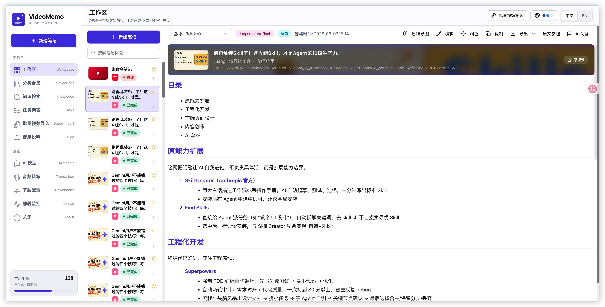
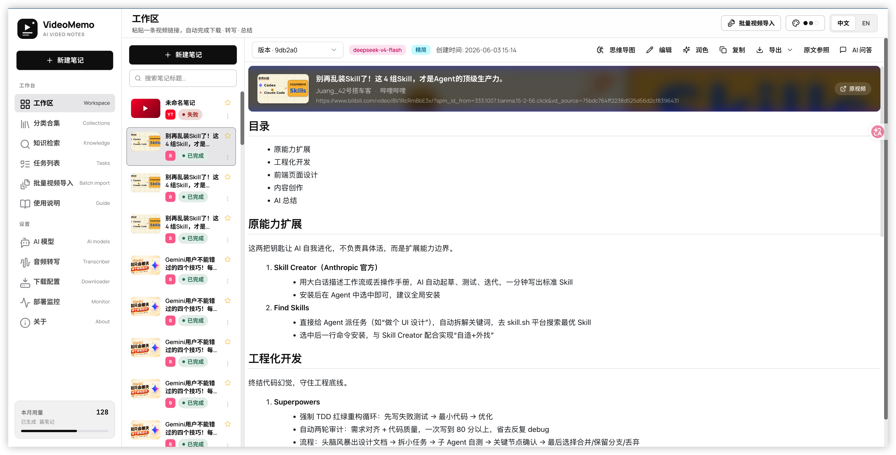
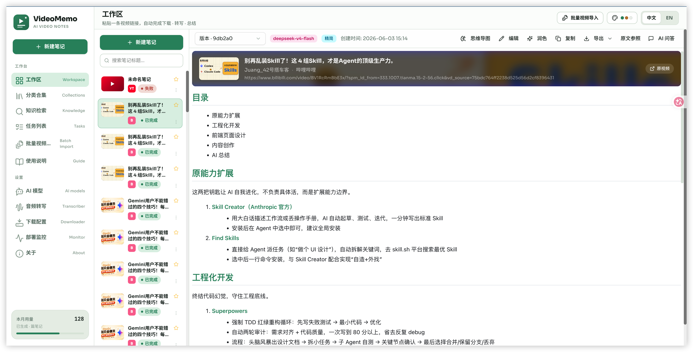
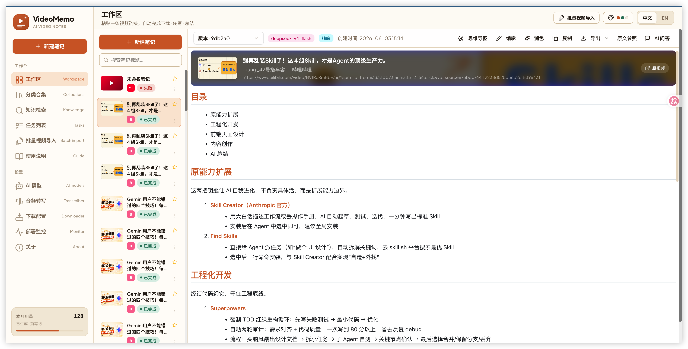
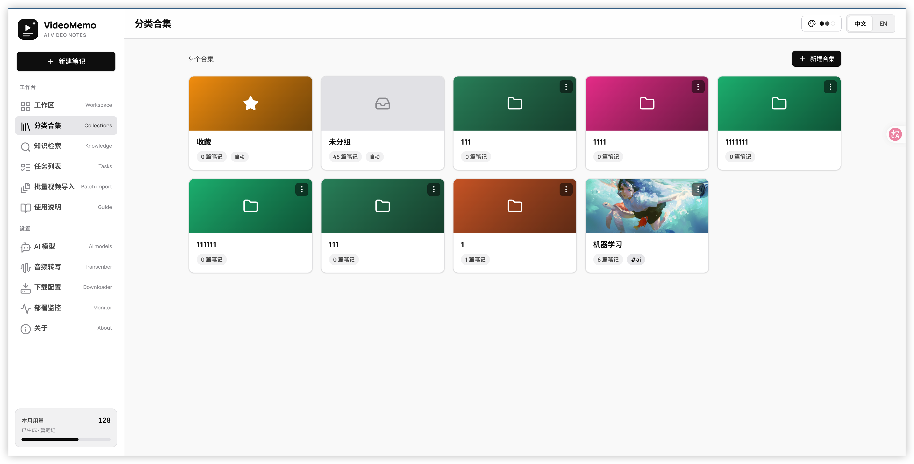
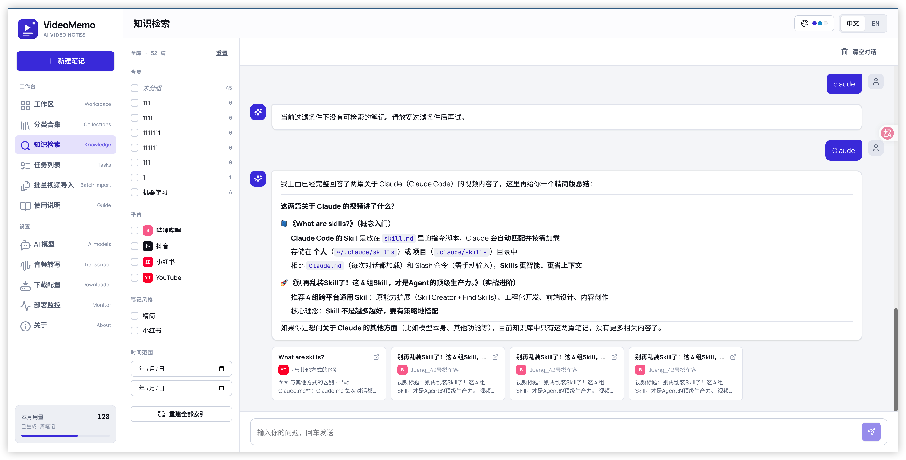
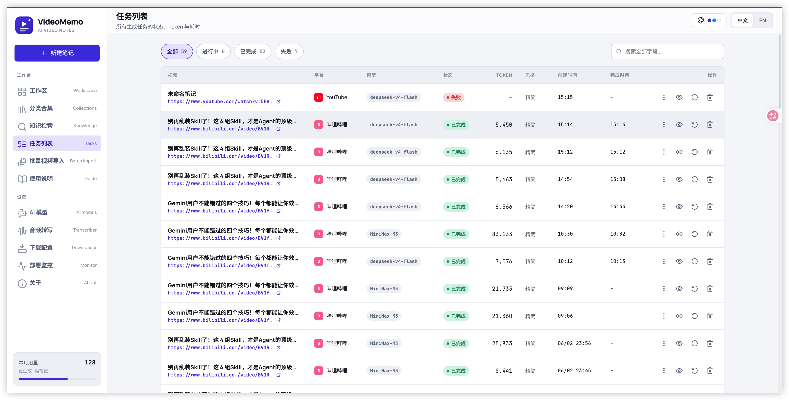
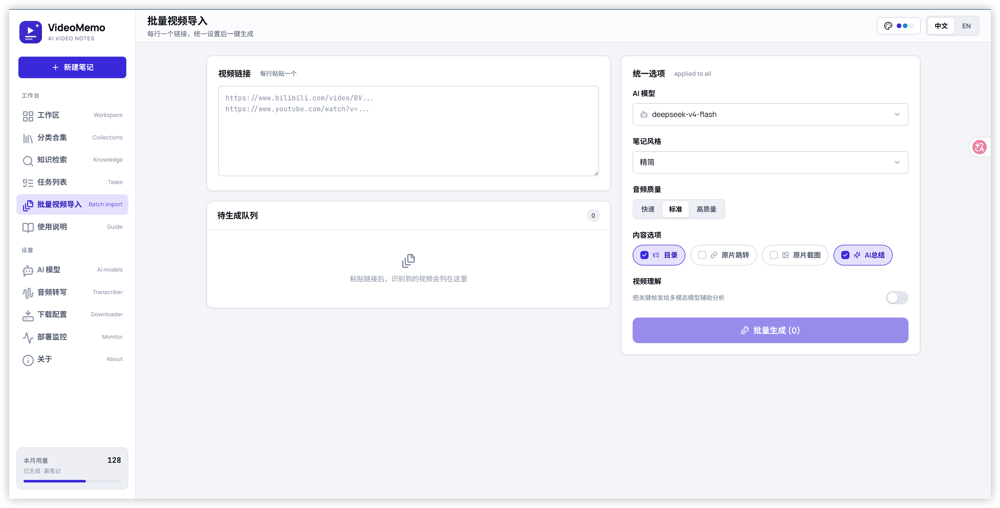

<div align="center">
  
  <h1>VideoMemo v2.3.5</h1>
  <p><i>把视频变成结构化的 AI 笔记 —— 一个开源、可扩展、可桌面化的视频备忘工具</i></p>

  <p>
    
    
    
    
    
    
  </p>
</div>

---

## ✨ 项目简介

**VideoMemo** 是一个开源的 AI 视频笔记助手：粘贴一条视频链接（B 站 / YouTube / 抖音 / 快手 / 小红书 / 本地文件），自动完成「下载 → 转写 → 总结」，输出结构清晰、可截图、可跳转、可二次问答的 Markdown 笔记。

- 全本地化运行，模型/转写引擎/Cookie 都在你自己的机器上
- 支持桌面客户端（Tauri）、Docker、源码三种部署方式
- 内置浏览器扩展、AI 问答、闪卡学习、分类合集、批量导入等进阶玩法

## 📸 截图预览

### 页面主题

内置多套配色主题，一键切换：

| 默认 · 靛蓝 | 极简 · 黑白 |
| :---: | :---: |
|  |  |
| **森林 · 绿** | **暖阳 · 橙** |
|  |  |

### 功能页面

| 分类合集 · 闪卡 / 同步 | 知识检索 · 跨笔记 RAG 问答 |
| :---: | :---: |
|  |  |
| **任务列表 · Token 统计** | **批量视频导入** |
|  |  |

## ✨ 最近更新

把视频工具升级成「个人视频知识库」的一轮迭代，分四块：

- **跨笔记知识库问答**：原「知识检索」空占位页变成完整的**跨笔记 RAG 对话页**。粘几十个视频后，可以问「这些视频里关于 Skills 的核心观点是什么」，引用卡片支持点击直达原笔记 + 时间戳。
- **多格式导出**：工作区顶栏的「导出」从单一 Markdown 升级成下拉菜单，支持 **Markdown / PDF / Word / HTML** 四种格式，中文文件名按 RFC 5987 编码不丢字。
- **笔记编辑 + AI 重新润色**：每篇笔记新增「编辑」（分屏所见即所得 markdown 编辑器）和「润色」（选风格 + 额外指令，AI 用现有 transcript 重写新版本）；完整多版本切换、删除、自动重建向量索引。
- **合集页「未分组」虚拟合集 + 知识检索过滤栏扩展**：合集页第一张卡永远是「未分组（N 篇）」，自动收纳所有未归类的笔记；知识检索过滤栏也加上「未分组 / 笔记风格」两组勾选。

## 🔧 功能特性

| 模块 | 说明 |
| --- | --- |
| **多平台 + 自定义平台** | 内建 B 站 / YouTube / 抖音 / 快手 / 小红书 / 本地文件；可在「下载配置」自己登记任意 yt-dlp 支持的平台并存 Cookie |
| **AI 视频笔记生成** | 基于 OpenAI 兼容大模型，支持精简 / 详细 / 教程 / 学术 / 小红书 / 会议纪要等多种风格，可选目录、原片跳转、关键画面截图 |
| **音频转写** | 优先使用平台字幕；无字幕时本地转写。Apple Silicon 推荐 `mlx-whisper`，通用环境用 `fast-whisper`，多档模型可选下载 |
| **步骤暂停 / 继续** | 生成流程分 5 步可视化呈现，前 3 步任意时刻可暂停，进入「总结」后自动锁定并提示「即将完成」 |
| **任务列表与 Token 统计** | 记录每个任务的视频、平台、模型、状态、消耗 Token、创建 / 完成时间；按列搜索过滤，默认显示当天 |
| **分类合集 + 闪卡学习** | 把相关笔记归类，支持封面 / 标签 / 右键菜单；一键 AI 生成问答闪卡复习，或导出 ZIP / JSON / 推送 Google Drive |
| **「未分组」虚拟合集** | 合集页自动出现一张「未分组」卡片，收纳所有还没归类的笔记，无需手动维护；新建笔记自动出现在这里 |
| **批量视频导入** | 多链接一次粘贴，自动按 URL 识别平台，统一应用模型 / 风格 / 格式选项，一键批量生成 |
| **浏览器 Cookie 读取** | YouTube 推荐 `cookies-from-browser`，从你登录的 Chrome / Edge / Firefox / Safari 实时读取，规避会话轮换 |
| **笔记内 AI 问答** | 基于已生成笔记和转录文本的 RAG 问答，可调用工具检索原文、视频元信息，精准回答你的问题 |
| **跨笔记知识库问答**（新） | 跨全库 / 合集 / 平台 / 风格 / 时间 多维过滤后，对你所有笔记做 RAG 对话；答案带引用卡片，点击直达原笔记 + 时间戳锚点 |
| **多格式导出**（新） | 工作区「导出」下拉支持 Markdown / PDF / Word / HTML，截图自动 base64 内嵌、中文文件名 RFC 5987 编码 |
| **手动编辑 + AI 重新润色**（新） | 笔记顶部加「编辑」（分屏 markdown 编辑器）/「润色」（选新风格 + 额外指令重写）；多版本切换、删除、保存后自动重建向量索引 |

## 🚀 快速开始

### 方式一：Docker 部署（推荐）

```bash
git clone https://github.com/xiaokeaijqx/VideoNote.git
cd VideoNote
cp .env.example .env

# 标准部署
docker compose up --build -d

# GPU 加速部署（需要 NVIDIA GPU + Container Toolkit）
docker compose -f docker-compose.gpu.yml up --build -d
```

默认前端 `http://localhost:${FRONTEND_PORT}`，后端 `http://localhost:${BACKEND_PORT}`；端口/环境变量在 `.env` 自定义。

### 方式二：源码部署

```bash
# 1. 克隆仓库
git clone https://github.com/xiaokeaijqx/VideoNote.git
cd VideoNote
cp .env.example .env

# 2. 启动后端（FastAPI · Python 3.11）
cd backend
python3.11 -m venv venv
./venv/bin/pip install -r requirements.txt
./venv/bin/python main.py        # 监听 0.0.0.0:8483

# 3. 启动前端（Vite + React）
cd ../VideoMemo_frontend
pnpm install
pnpm dev                          # 开发服务器 http://localhost:3015
```

### 方式三：桌面客户端

去 [Releases](https://github.com/xiaokeaijqx/VideoNote/releases) 下载安装包，开箱即用，内置 Python 后端，无需自己配环境。

- **Windows**：请安装到**没有中文、没有空格**的路径，否则 PyInstaller sidecar 启动会失败。
- **macOS（Apple Silicon）**：应用未做 Apple 签名 / 公证，首次打开可能被系统拦下：
  - 提示「**无法验证开发者**」——右键点 VideoMemo → 打开 → 在弹窗里再点「打开」即可。
  - 提示「**已损坏，应移到废纸篓**」——这不是真损坏，是 Gatekeeper 拦截未签名应用。打开「终端」执行下面一行去掉隔离属性后再正常双击（注意：「右键打开」对「已损坏」无效）：

    ```bash
    sudo xattr -dr com.apple.quarantine /Applications/VideoMemo.app
    ```

  > 以上只需在首次安装时做一次。

## 📖 从零生成第一篇笔记（6 步）

启动后跟着「使用说明」页一步步走即可：

1. **配置 AI 模型** —— 设置 → AI 模型设置 → 新建供应商（DeepSeek / OpenAI 兼容 / 本地都支持），填好 API Key，启用要用的模型。
2. **准备音频转写器** —— 设置 → 音频转写配置，选引擎并下载模型。Apple Silicon 推荐 `mlx-whisper`，通用环境用 `fast-whisper`；`tiny / base` 几十 MB，`large-v3-turbo` 质量最高。
3. **配置平台 Cookie（按需）** —— 设置 → 下载配置 → 对应平台，粘贴 Cookie 或选择浏览器实时读取。YouTube 强烈推荐 `cookies-from-browser`，避免被风控轮换作废。
4. **新建一篇笔记** —— 回到工作区，点左侧历史栏顶部 `+ 新建笔记`，粘贴视频链接（B 站 / YouTube / 抖音 / 快手 / 本地文件均可），平台自动识别；选好模型与风格，勾选需要的内容（目录 / 原片跳转 / 截图等），点「生成笔记」。
5. **看任务进度 / 暂停继续** —— 进度条会显示「解析 → 下载 → 转写 → 总结 → 完成」五步。前三步之间可暂停；到「总结」就只能等它跑完。想看所有任务的状态 / Token 消耗，去「任务列表」，支持按列搜索过滤。
6. **整理 & 复习** —— 把生成的笔记拖到「分类合集」归类，按合集导出 ZIP / JSON / 推送 Google Drive；想巩固内容，一键 AI 生成「闪卡学习」自测；想再深挖，点笔记顶部「AI 问答」基于原文做 RAG 对话。

## ⚙️ 依赖说明

### 🎬 FFmpeg
源码部署时必须安装（Docker 镜像已内置）：

```bash
# macOS
brew install ffmpeg

# Ubuntu / Debian
sudo apt install ffmpeg

# Windows
# 从 https://ffmpeg.org/download.html 下载，安装后加入 PATH
```

### 🚀 CUDA 加速（可选）
要更快地转写，可上 NVIDIA GPU + `fast-whisper` + CUDA。配置见 [faster-whisper README](https://github.com/SYSTRAN/faster-whisper#requirements)。

## 🛠 技术栈

- **后端**：Python 3.11 · FastAPI · SQLite + SQLAlchemy · yt-dlp · FFmpeg · faster-whisper / mlx-whisper / Groq / BCut · Blinker 事件 · RAG (Chroma + Function Calling)
- **前端**：React 19 · Vite · TypeScript · Tailwind · shadcn/ui · Zustand · IndexedDB 持久化 · i18next
- **桌面**：Tauri v2（Rust + WebView）
- **浏览器扩展**：Vue 3 · Vite · vitesse-webext · MV3 · UnoCSS · webextension-polyfill
- **部署**：Docker / docker-compose · Nginx · PyInstaller sidecar

## 🐳 Docker 部署 FAQ

社区反馈最集中的几个坑：

**1. 国内拉不到 docker.io（build 报 `dial tcp ... i/o timeout`）**
- 推荐用预构建镜像（如有 GHCR 镜像），或在 `~/.docker/daemon.json` 配置镜像加速器，或临时使用 `BASE_REGISTRY` build-arg：
  ```bash
  BASE_REGISTRY=docker.m.daocloud.io docker compose build
  ```

**2. 容器一直 restart / unhealthy**
- 查后端日志：`docker logs -f videomemo-backend`，启动会按顺序打 `[startup 1/5] ... 5/5`，卡在哪步就排查哪步。
- 首次跑视频被 OOM kill：whisper 模型太大，先把 `WHISPER_MODEL_SIZE` 改成 `tiny`，跑通再升档。

**3. 改了 `.env` 没生效**
- `VITE_*` 是**构建时**变量，必须 `docker compose build frontend && docker compose up -d`。
- 其他后端变量是**运行时**变量，`docker compose up -d` 即可。
- **LLM API Key 不要写 `.env`**，从前端「模型供应商」录入，会持久化到 SQLite。

**4. 数据存在哪？删容器会丢吗？**
- `docker-compose` 默认 `./backend:/app` 绑挂，下面文件都在宿主机里：
  - `./backend/video_memo.db` —— SQLite 库（含供应商配置、笔记历史）
  - `./backend/config/transcriber.json` —— 转写器配置
  - `./backend/static/screenshots/` —— 视频截图
  - `./backend/uploads/` —— 上传的本地视频

## 🧩 浏览器扩展

```bash
cd VideoMemo_extension
pnpm install
pnpm dev          # watch 模式，产物在 ./extension/
```

Chrome / Edge 在 `chrome://extensions/` 打开开发者模式 → 加载已解压扩展 → 选 `VideoMemo_extension/extension/`。后端地址默认 `http://localhost:8483`，在 Options 页可改。

## 🧠 TODO

- [x] 支持抖音及快手等视频平台
- [x] 前端切换 AI / 转写模型
- [x] AI 摘要风格自定义
- [x] 基于 RAG 的笔记内容 AI 问答
- [x] 跨笔记的知识库问答（含合集/平台/风格/时间过滤）
- [x] 分类合集 + 闪卡学习 + 未分组虚拟合集
- [x] 批量视频导入
- [x] 笔记导出为 PDF / Word / HTML / Markdown
- [x] 手动编辑笔记 + AI 重新润色（多版本）
- [ ] **云端推送**：合集 / 笔记一键同步到 Notion / 飞书 / 语雀 / OneDrive / iCloud（在现有 Google Drive 之上扩展，提供 OAuth + 选择目标 + 增量同步）

## 📜 License

本项目遵循 [Apache License 2.0](./LICENSE)（[协议全文](https://www.apache.org/licenses/LICENSE-2.0)），可以自由使用、修改、分发、用于商业用途，但分发时需要保留原始版权声明，并在显著位置标注「基于 VideoMemo 修改」。

## 🔎 代码参考
- 抖音下载部分参考自 [Evil0ctal/Douyin_TikTok_Download_API](https://github.com/Evil0ctal/Douyin_TikTok_Download_API)
- 视频笔记生成框架基于 [JefferyHcool/BiliNote](https://github.com/JefferyHcool/BiliNote) 二次开发与重命名

---

💬 欢迎 PR、Issue、Star ⭐️ —— 你的反馈是持续优化的动力。
